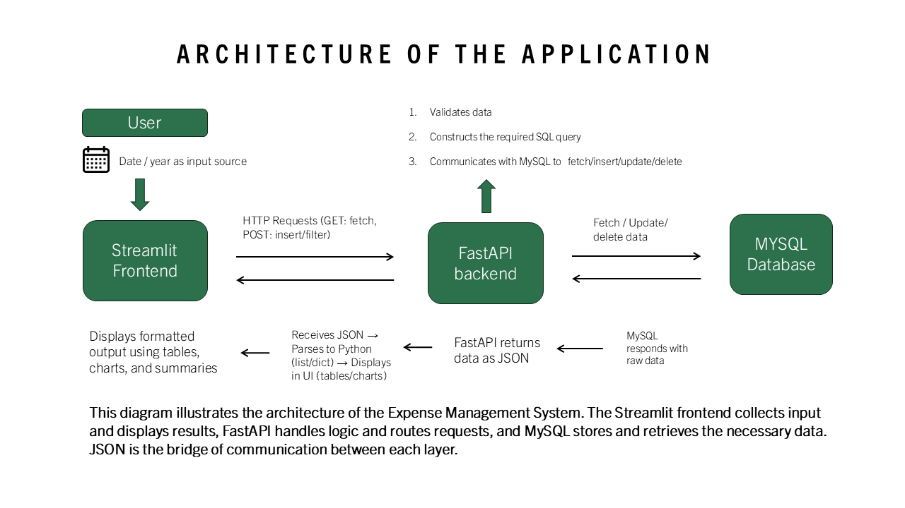
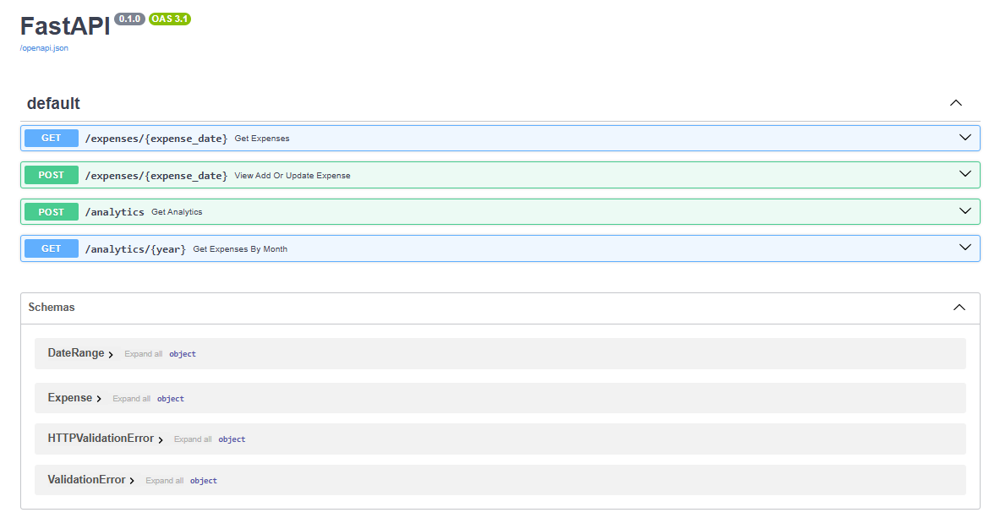
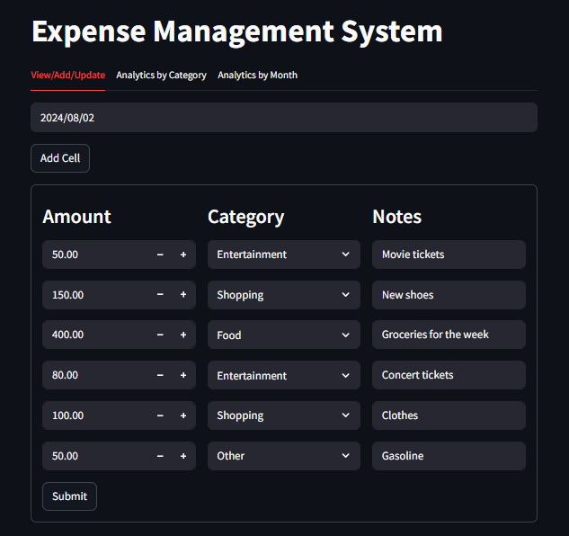
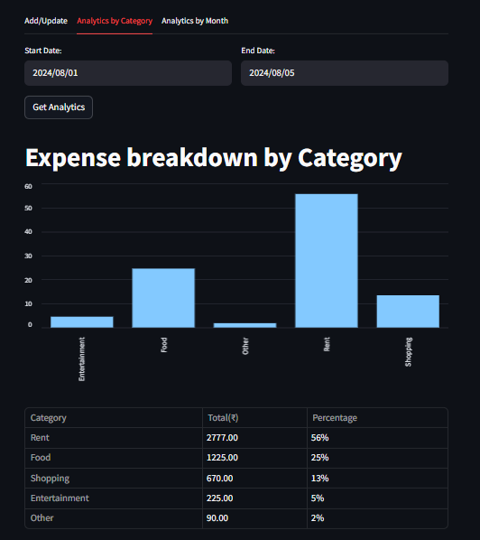
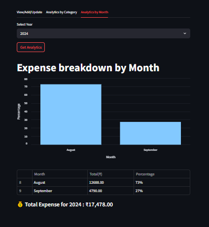

# Expense Management System

This is an **Expense Management System** consisting of a **Streamlit frontend** and a **FastAPI backend**. It allows users to record, update, and analyze their expenses across different categories and time periods.

---

## Project Structure

- **frontend/** - Contains the streamlit application code
- **backend/** - Contains the FastAPI backend server code
- **tests/** - Contains the unit tests for both frontend and backend utilities
- **requirements.txt** - Lists the required Python packages
- **README.md** - Provides an overview and instructions for the project

---

## 🧱 System Architecture

The following diagram illustrates the high-level architecture of the Expense Management System.  
It shows how the frontend, backend, and database components interact with each other.



---

## 🚀 Features

- 📅 Add and update expenses by date
- 📊 Visualize expenses by category and month
- 🔄 Backend API for data persistence and communication
- 🧪 Modular code with unit tests for backend utilities

---

### ⚙️ API Documentation (Swagger UI)

The FastAPI backend comes with an interactive API documentation interface powered by **Swagger UI**.

You can explore available endpoints like `GET` and `POST` requests for expenses and analytics.



---

## Project Interface & Visual Overview


### 📝 View, Add, or Update Expenses


### 📊 Analytics by Category  


### 📆 Analytics by Month  


---

## Setup Instructions

1. **Clone the Repository**:
   ```bash
   git clone https://github.com/Dinesh281197/Expense-Management-System.git
   cd Expense-Management-System
   ```

2. **Install Dependencies**:
   ```commandline
   pip install -r requirements.txt
   ```

3. **Run the FastAPI server**:
   ```commandline
   uvicorn backend.server:app --reload
   ```
   
4. **Run the Streamlit app**:
   ```commandline
   streamlit run frontend/app.py
   ```
---- 

## 🗄️ Database Setup

You can find the MySQL database schema used in this project in the 📂 ['database/expense_db_creation.sql'](database/expense_db_creation.sql)

> Note: This schema was provided by Codebasics as part of their Data Analytics Portfolio Project series.
>
----

## 🛠 Tech Stack

- **Frontend**: [Streamlit](https://streamlit.io/)
- **Backend**: [FastAPI](https://fastapi.tiangolo.com/)
- **Database**: MySQL (connected using `mysql-connector-python`)
- **Testing**: `pytest`
- **Logging**: Python's built-in `logging` module
- **Environment Configuration**: python-dotenv

---

## 📌 Project Walkthrough

Want to understand how the project works and the problems it solves?  
Check out my [LinkedIn post](your-post-link) where I shared the complete breakdown and presentation slides.

---

## 👤 About Me

Hi! I'm **Dinesh Kumar**, an aspiring **Data Analyst** passionate about transforming raw data into meaningful insights.  
I’m actively building job-ready skills through hands-on projects in **Excel**, **SQL**, **Power BI**, **Python**.

This Expense Management System project is part of my learning journey through the **Codebasics Python for Data Professionals** course, where I explored the use of **FastAPI**, **Streamlit**, and **MySQL** to build a full-stack analytical application.

Feel free to connect with me on [LinkedIn](https://www.linkedin.com/in/sdk021/) or explore my other projects on [GitHub](https://github.com/Dinesh281197).

---

## 🙏 Acknowledgements

This project is part of the **Codebasics Data Analytics Portfolio Project series**.

- Special thanks to **[Codebasics](https://www.linkedin.com/company/codebasics/posts/?feedView=all)** and **[Dhaval Patel](https://www.linkedin.com/in/dhavalsays/)** for the project guidance and dataset.
- MySQL schema and project structure were provided as part of the guided learning experience.

---

## 📄 License

This project is for **learning purposes only** and follows the Codebasics terms for educational use.  
Please do not redistribute or commercialize any part of this project without permission.

---